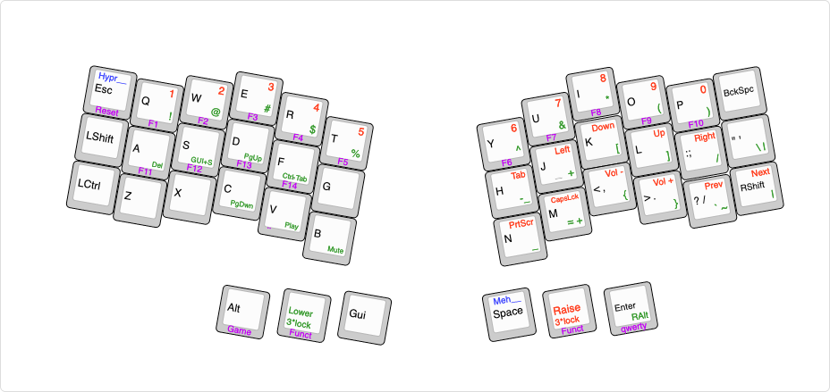

# My keymap for the CRKBD

Based on the mechboards r2g and [mattsennas](https://github.com/Mattsenna/QMK_corne) keymap.

## Setup

First clone the qmk firmware repo:
```sh
git clone git@github.com:qmk/qmk_firmware.git
```

And follow the setup instructions on [docs.qmk.fm](https://docs.qmk.fm/#/newbs) or read up on QMK in general at [qmk.fm](https://qmk.fm/)

Then go into the root directory of the qmk firmware (whereever you just cloned it to) and clone this repo into `/keyboards/crkbd/keymaps/noinfo`:
```sh
git clone git@github.com:noinfo/QMK_corne.git /keyboards/crkbd/keymaps/noinfo
```

## Building

In the root directory of the qmk firmware do:

```sh
qmk compile -kb crkbd/r2g -km noinfo
```

## Flashing

In the root directory of the qmk firmware do:

```sh
qmk flash -kb crkbd/r2g -km noinfo
```

...or use the [QMK toolbox](https://github.com/qmk/qmk_toolbox) and the firmware file from the root directory
## Keymap JSON

```sh
qmk c2json -kb crkbd/r2g -km noinfo -o keymap.json keymap.c
```

_ATTENTION_ Remove the JSON from the folder before compiling the firmware. Can be safely used for printing purposes.

## Layout-Resources

In the folder `layout-editor-resources` you can find resources from and for [keyboard-layout-editor](http://www.keyboard-layout-editor.com/#/) for a single graphic containing info on all layers (work in progress).


